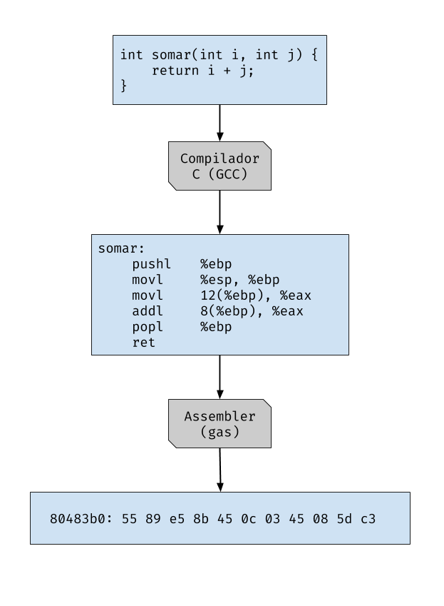
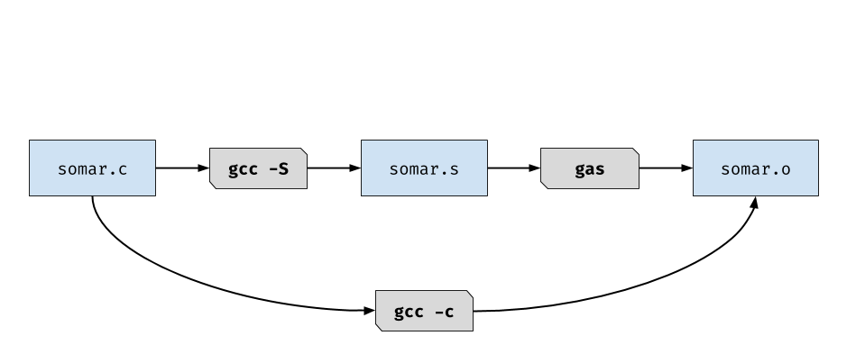
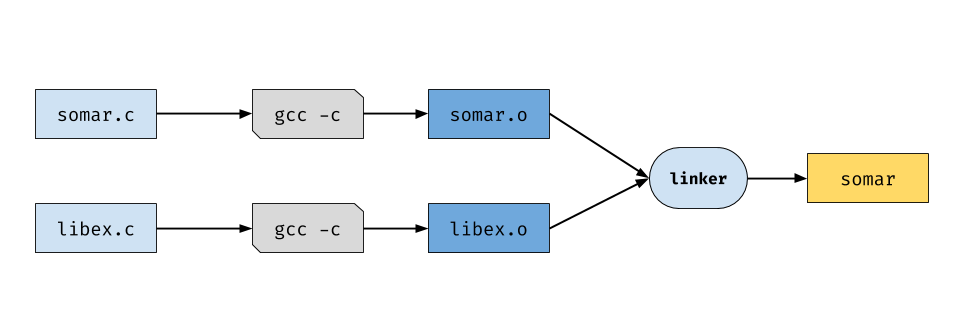

# Semana 01

## Introdução


### Sobre o que é este curso?

- Como os programas escritos em uma linguagem de alto nível (ex.: Java, C++) são transformados em código de máquina?
- Como podemos garantir que um programa tenha um significado (semântica)?
- Como é realizado o gerenciamento de memória do programa?
- Como nós podemos analisar programas para descobrir propriedades invariantes (constantes) e melhorar o desempenho em tempo de execução?

Ao longo do curso todas essas perguntas ficarão mais claras.

### Nota histórica

- Até a década de 50, computadores eram programados em assembly.
- Em 1951-1952, Grace Hopper desenvolveu o sistema A-0 para o UNIVAC I.
  - Posteriormente ela contribuiu significativamente para o desenvolvimento da linguagem COBOL.
- Em 1957 o compilador de FORTRAN foi desenvolvido pela IBM.
  - Com uma equipe liderada por John Backus.
- Na decada de 60 ocorreu o desenvolvimento do primeiro compilador de bootstrapping para LISP.
- Na decada de 70 o design de linguagens/compiladores floresceu*.
- Hoje nós temos milhares de linguagens a disposição (muitas delas pouco utilizadas).
  - Algumas com um design melhor que outras.

### Arquitetura básica

  
*Para manter uma fidelidade maior ao material, optamos por manter alguns termos em inglês. Porém suas equivalências serão feitas posteriormente.

#### Front-end

- Realiza a análise léxica, sintática e semântica (Lexing e Parsing);
  - Faz a conversão de cadeias de caracteres (código fonte) em estruturas de dados internas do compilador.
  - Ocorre usualmente em duas fases:


#### Ferramentas de *Parsing*

- A etapa de *parsing* ocorre basicamente em todas as aplicações.
  - Ex.: Barra de pesquisa do Google, calendários, etc.
  - É o primeiro passo para transformar dados brutos em informação.
- Um pouco de teoria da computação pode te ajudar a entender esses passos (aqui vai um [link](https://cs121.boazbarak.org))
  - Expressões regulares
  - Gramáticas livre de contexto (automato de pilha)
  - Essas abstrações aparecem também na etapa de otimização!
- Existem também muitas ferramentas para te ajudar nessa etapa:
  - Ex.: Yacc e Lex, Menhir, Antlr, *Parsing Combinators*, etc.

#### Análise Semântica (Elaboration)

- É aqui onde ocorre as checagens de tipos.
  - Resolver variáveis, módulos, etc.
  - Checagem das operações sobre os tipos (se a operação é válida sobre aquele tipo de variável).
  - Infere tipos para sub-expressões.
  - Checa outros problemas.


#### Geração de Código Intermediário (Lowering)

- Traduz recursos de alto nível em um pequeno número de instruções.
  - Ex.: `while`, `for`, `do-while` são traduzidos basicamente em instruções utilizando `goto`.
  - Ex.: Objetos, closures e funções de ponteiros.
  - Ex.: Realiza testes de tipagem, verificações de tamanho de arrays, etc. (Explicitamente).

#### Otimização de Código

- Reescreve sequências instruções custosas em sequências menos custosas.
  - Ex.: operações com constantes: `3 + 4` → `7`
  - Ex.: Retira uma instrução invariável de um loop
  - Ex.: Paraleliza um loop


#### Geração de Código

- Traduz o código intermediário em código de máquina (ou algum código alvo).
  - Registra atribuições
  - Instruções de seleção
  - Instruções de scheduling
  - Otimização específica para a arquitetura de cada máquina

### Quem deve fazer o CS153?

- Pessoas facinadas por linguagens de programação e compiladores
  - "Por que esta linguagem não inclue essa feature?"
  - Programadores de sistemas
- Conheça a ferramenta que você usa todos os dias
  - "O que o compilador não pode fazer tão bem?"
- Designers de Arquiteturas
  - Interdependência entre compiladores e arquiteturas
  - Veja as falhas do Intel iAPX 432 e Intel Itanium em relação a compiladores
  - Atualmente, o pessoal da arquitetura usa compiladores também!
- Desenvolvedores de APIs
  - Uma linguagem é uma API
  - Ex.: A linguagem Hack do Facebook.

### Conhecimentos adquiridos

- Você vai aprender sobre:
  - Aplicações práticas da teoria
  - Análise léxica, sintática e interpretadores
  - Como linguagens de alto nível são implementadas em código de máquina
  - (Um subconjunto) da arquitetura Intel x86
  - Mais sobre ferramentas de compiladores como GCC e LLVM
  - Um entendimento maior sobre códigos
  - Um pouco sobre semântica das linguagens de programação, análises de programas e tipos
  - Como manipulas estruturas de dados complexas
  - Como ser um melhor programador

### Pré-requisitos sugeridos

- É interessante saber sobre teoria da computação, estruturas de dados e arquitetura de computadores
- A linguagem utilizada nos materiais é OCaml, porém optamos por adaptar ao [ReasonML](https://reasonml.github.io)

### Administrivia

- [Website do curso](https://www.seas.harvard.edu/courses/cs153)

### Textbook (Leituras sugeridas)

- [Modern Compiler Implementation in ML](https://www.cs.princeton.edu/~appel/modern/ml/) by Andrew W. Appel
  - Recomendado porém não obrigatório
- Na maioria dos casos os matériais disponibilizados serão suficientes

### Ambiente de desenvolvimento

- OCaml
  - Ideal para desenvolver compiladores
    - Desenvolvida para permitir uma fácil manipulação de árvores de sintaxe abstrata (AST)
    - Linguagem funcional com suporte para tipos de dados algébricos polimórficos (genéricos), suporte para módulos e estado mutável.

### Projetos

- 6 projetos serão desenvolvidos, em sua maioria implementando partes de um compilador
- Em sua maioria tomam 2-3 semanas
- Implementados em OCaml (materiais originais) e ReasonML (materiais extras criados por mim)

- 1. HelloOCaml
  - Refrescar um pouco da codificação em OCaml
  - Implementar um interpretador
- 2. x86Lite
  - x86 Assembler e Simulator
  - Entender o código de máquina que buscamos gerar
- 3. Compilação LLVMlite
  - Compilar um subconjunto simples de LLVM para x86Lite
- 4. OAT v1
  - Parsing e Lexing (Análise Léxica e Sintática)
  - Um front-end simples de um compilador
- 5. OAT v2
  - Structs, function pointers (ponteiros de funções)
  - Uma geração de código (intermediário e alvo) simples
- 6. Análise do fluxo de dados e otimização

- **Qualquer dúvida utilizem as [Issues](https://github.com/jose-gilberto/harvard-cs153/issues) do Github como fórum, a comunidade e eu podemos ajudar a resolver. Toda dúvida é válida e deve ser sanada, conhecimento é um bem para todos e todos os níveis dele são válidos :)**

### "História do ML"

- Em 1971, Robin Milner iniciou o projeto LCF em Stanford
  - "Lógica de funções computáveis"
- Em 1973, em Edimburgo, Milner implementou seu provador de teoremas e o apelidou de "Meta Language" - ML para os intimos.
- Em 1984, o ML escapou para o mundo selvagem e se tornou "Standard ML"
  - SML'97 é a versão mais nova do Standard
  - Há uma grande família de compiladores SML:
    - SML/NJ: desenvolvido na AT&T Bell Labs
    - Poly/ML
    - Moscow ML
    - ML Kit Compiler
    - MLj: Compilador SML para Java bytecode
    - MLton: compilador de otimização de programa inteiro
    - CakeML: dialeto para ser fácil de programar e raciocinar sobre
- ML2000: falha na padronização revisada
- sML: sucessor do ML (discutido de forma intermitente)
- Veja um pouco mais [aqui](http://sml-family.org/)

### História do OCaml

- Em 1987, Guy Cousineau reimplementou uma variação do ML
  - A implementação foi nomeada como "Categorical Abstract Machine" (CAM)
  - Rapidamente, "CAM-ML" se tornou "CAML"
- Em 1991, Xavier Leroy e Damien Doligez escreveram Caml-light
  - Compilando CAML para uma máquina virtual com um bytecode simples (bem mais rápido)
- Em 1996, Xavier Leroy, Jérôme Vouillon e Didier Rémy:
  - Adicionaram um sistema de objetos para criar o **OCaml**
  - Adicionaram também uma compilação de código nativo
- Muitas atualizações, extensões foram feitas desde então
- A linguagem F# da Microsoft é descendente do OCaml
- Um pouco mais você pode encontrar [aqui](https://ocaml.org/)

### Ferramentas do OCaml

- ocaml
- ocamlc: compilador de bytecode
- ocamlopt: compilador de código nativo
- ocamldep: analisador de dependências
- ocamldoc: gerador de documentação
- ocamllex: o gerador de analisadores léxicos (lexer)
- ocamlyacc: gerador de analisadores sintáticos (parser)
- menhir: um gerador de analisadores sintáticos (parser) mais moderno
- ocamlbuild: um gerenciador de compilação
- utop
- opam: gerenciador de pacotes

### Uma linguagem simples

- Considerando uma linguagem simples com expressões e comandos
- Exemplo de programa para computar fatoriais:
```
X = 6;
ANS = 1;
whileNZ (X) {
    ANS = ANS * X;
    X = X + -1;
}
```
- Para descrever essa linguagem nós precisamos de:
  - Sintaxe: que sequência de caracteres formam comandos válidos/programa válido?
  - Semântica: o que um programa significa?

```
<exp> ::=
      | <X>
      | <exp> + <exp>
      | <exp> * <exp>
      | <exp> < <exp>
      | <integer constant>
      | (<exp>)
```

```
<cmd> ::=
      | skip
      | <X> = <exp>
      | ifNZ <exp> { <cmd> } else { <cmd> }
      | whileNZ <exp> { <cmd> }
      | <cmd>; <cmd>
```

- **Sintaxe Concreta** (gramática) para uma linguagem imperativa simples
  - Escrita na forma de Backus-Naur (*Backus-Naur form*)
  - `<exp>` e `<cmd>` são símbolos não terminais
  - `::=`, `|` e `<...>` são partes da metalinguagem
  - Palavras chave, como `skip` e `ifNZ`, e símbolos como `{` e `+` fazem parte da linguagem objeto
- Precisa representar a sintaxe abstrata (ou seja, ocultar partes irrelevantes da sintaxe concreta)
- Implementar a semântica operacional (ou seja, define o comportamento/ignificado do programa)
- Veja a seguir:

```ocaml
(* Implementação de uma simples linguagem orientada a comandos. *)


(* gramática ------------------------------------------------------------------ *)
(*
 gramática BNF para essa simples linguagem:
  <exp> ::= 
         |  <X>
         |  <exp> + <exp>
         |  <exp> * <exp>
         |  <exp> < <exp>
         |  <integer constant>
         |  (<exp>)

  <cmd> ::= 
         |  skip
         |  <X> = <exp>
         |  ifNZ <exp> { <cmd> } else { <cmd> }
         |  whileNZ <exp> { <cmd> }
         |  <cmd>; <cmd>
*)

(* Sintáxe Abstrata (AST) ---------------------------------------------------- *)

type var = string

type exp =
  | Var of var
  | Add of (exp * exp)
  | Mul of (exp * exp)
  | Lt  of (exp * exp)
  | Lit of int

type cmd =
  | Skip
  | Assn    of var * exp
  | IfNZ    of exp * cmd * cmd
  | WhileNZ of exp * cmd
  | Seq     of cmd * cmd


(* AST para o exemplo Fatorial ------------------------------------------------ *)
(*
        X = 6;
	ANS = 1;
	whileNZ (x) {
  		ANS = ANS * X;
  		X = X + -1;
	} 
 *)

let factorial : cmd =
  let x = "X" in
  let ans = "ANS" in
  Seq (Assn (x, Lit 6),
       Seq (Assn (ans, Lit 1),
            WhileNZ(Var x,
                    Seq (Assn(ans, Mul(Var ans, Var x)),
                         Assn(x, Add(Var x, Lit (-1)))))))

(* Interpretador -------------------------------------------------------------- *)

type state = var -> int

let rec interpret_exp (s:state) (e:exp) : int =
  match e with
  | Var x -> s x
  | Add (e1, e2) -> (interpret_exp s e1) + (interpret_exp s e2)
  | Mul (e1, e2) -> (interpret_exp s e1) * (interpret_exp s e2)
  | Lt  (e1, e2) -> if (interpret_exp s e1) < (interpret_exp s e2) then 1 else 0
  | Lit n -> n

let update s x v =
  fun y -> if x = y then v else s y

let rec interpret_cmd (s:state) (c:cmd) : state =
  match c with
  | Skip -> s
  | Assn (x, e1) ->
    let v = interpret_exp s e1 in
    update s x v
  | IfNZ (e1, c1, c2) ->
    if (interpret_exp s e1) = 0 then interpret_cmd s c2 else interpret_cmd s c1
  | WhileNZ (e, c) ->
    if (interpret_exp s e) = 0 then s else interpret_cmd s (Seq(c, WhileNZ (e, c)))
  | Seq (c1, c2) ->
    let s1 = interpret_cmd s c1 in
    interpret_cmd s1 c2
  
let init_state : state = fun _ -> 0
```

## Assembly

### Nessa seção
- Vamos observar como converter C em código de máquina
- Aprender sobre o Intelx86
- x86Lite

### Convertendo C em código de máquina



Acima vemos a conversão de código c `somar.c`, para o código assembly `somar.s` e então para o código de máquina `somar.o`.

### Pulando a etapa do Assembly

- Muitos compiladores da linguagem C geram código de máquina (código objeto) diretamente
  - Isso é, sem gerar um código assembly legível
  - Linguagem assembly é mais usável para humanos, não para máquinas



- Podemos gerar o arquivo assembly do C utilizando o comando `gcc -S`
  - Que pode ser compilado para código objeto manualmente utilizando o *gas*

### Arquivos objeto e executáveis

- Um arquivo fonte em C (`somar.c`) é compilado para um arquivo objeto (`somar.o`)
  - O arquivo objeto contém código de máquina para aquele código C
  - Pode conter referências para variáveis e rotinas externas
  - Ex.: se `somar.c` chamar a rotina `printf()` então o `somar.o` irá conter uma referências para o `printf()`
- Multiplos arquivos são *ligados* (**linked**) para produzir um programa executável
  - Tipicamente, bibliotecas padrões (como a *libc*) são incluidas no processo
  - Bibliotecas são somente coleções de códigos pré-compilados, nada mais!



### Características da linguagem Assembly

- Assembly é uma linguagem muito, muito simples
- Possui estruturas de dados simples
  - dados inteiros de 1, 2, 4 ou 8 bytes
  - dados de ponto flutuante de 4, 8 ou 10 bytes
  - não existem estruturas de dados agregadas como arrays
- Operações primitivas
  - Performa operações aritméticas nos registradores ou na memória (Adição, multiplicação, etc)
  - Lê dados da memória para o registrador
  - Armazena dados do registrador na memória
  - Controle de transferência do programa
  - Testa uma flag de controle, um salto condicional (salta somente se a flag for 0)
- Outras operações complexas devem ser desenvolvidas com uma sequências (muitas vezes longa) de instruções

### Assembly vs Código de Máquina

- Nós escrevemos instruções em Assembly
  - Tais como: `addq %rbx, %rax`
- A máquina interpreta código de máquina em bits
  - 101011001100111...
- O assembler cuida para que o código assembly seja compilado para bits
  - Isso nos provê muitas conveniencias

### Arquitetura do Intelx86

- 1978: Intel introduces 8086
- 1982: 80186, 80286
- 1985: 80386
- 1989: 80486   (100MHz, 1µm)
- 1993: Pentium
- 1995: Pentium Pro
- 1997: Pentium II/III
- 2000: Pentium 4
- 2003: Pentium M, Intel Core
- 2006: Intel Core 2
- 2008: Intel Core i3/i5/i7
- 2011: SandyBridge / IvyBridge
- 2013: Haswell
- 2014: Broadwell
- 2015: Skylake (4.2GHz, 14nm)
- AMD tem uma linha paralela de processadores

### X86 vs. X86Lite

- Assembly do X86 é muito complexo e complicado:
  - 8-, 16-, 32-, 64-bits para valores de pontos flutuantes, etc
  - Arquiteturas Intel64 e IA 32 tem um longo número de funções
  - Instruções CISC complexas
  - Código de máquina: o *range* do tamanho das intruções variam de 1 byte até 17 bytes
  - Muitas decisões de design remanescentes para compatibilidade com versões anteriores
  - Difícil de entender, há um grande livro sobre otimizações apenas no nível de seleção de instrução
  - X86Lite é um simples subconjunto do X86:
    - Somente 64 bits de inteiros sinalizados (+/-)
    - Cerca de somente 20 instruções
    - Suficiente como indioma de chegada para o propósito do curso.
  
### Esquema X86

### Máquina de estados X86Lite: Registradores

- Arquivo de registrador: 16 registradores 64-bit

| Nome | Propósito |
| ---- | --------- |
| `rax` | Acumulador para propósitos gerais |
| `rbx` | Registrador base, ponteiro para dados |
| `rcx` | Registrador contador para strings e loops |
| `rdx` | Registrador de dados para entrada/saída |
| `rsi` | Registrador de ponteiro, registrador da fonte de strings |
| `rdi` | Registrador de ponteiro, registrador de destino de strings |
| `rbp` | Ponteiro base, aponta para a *stack frame* |
| `rsp` | Ponteiro da pilha (*stack*), aponta para o topo da pilha |
| `r08-r15` | Registradores para propósitos gerais |

- `rip` é um registrador "virtual", que aponta para a instrução atual
  - `rip` é manipulado diretamente e somente via `jumps`, saltos, e `return`, retornos.

### Instrução mais simples: *mov*

- `movq SRC, DEST` copia o SRC (fonte) para o DEST (destino)
- Aqui DEST e SRC são operandos
- DEST é tratado como uma localização
  - Uma localização pode ser um registrador ou um endereço de memória
- SRC é tratado como um valor
  - Um valor pode ser o conteúdo de um registrador ou um endereço de memória
  - Um valor pode ser uma constante ou um label
- Exemplos:
  - Move a constante de 64 bits com valor 4 para o `rax`  
```nasm
movq $4, %rax 
```
  - Move o conteúdo de `rbx` para o `rax`
```nasm
movq %rbx, %rax 
```

### Uma observação sobre a sintaxe da instrução

- X86 apresenta duas formas de sintaxe
- notação AT&T: `source` antes do `destination`, ou seja, fonte antes do destino
```nasm
movq $5, %rax
movl $5, %eax
```
  - Prevalente nos ecossistemas UNIX/Mac
  - Valores constantes são precedidos de um `$`
  - Registradores são precedidos de um `%`
  - Sufixos mnemônicos: `movq` vs `mov`
    - `q` = quadword (4 palavras)
    - `l` = long (2 palavras)
    - `w` = word (1 palavra)
    - `b` = byte
- notação Intel: `destination` antes do `source`
```nasm
mov rax, 5
mov eax, 5
```
  - Usada nas especificações da intel e manuais
  - Prevalente no ecossistema Windows
  - Variação das instruções são determinadas pelo nome do registrador
- Obs.: X86Lite utiliza a notação AT&T e o formato de intruções e registradores de 64 bits

### Desvio: Complemento de 2

- Representar inteiros não negativos em bits é simples
- Mas como representamos inteiros negativos em bits?
- Três codificações comuns:
  - Sinal e magnitude
  - Complemento de um
  - Complemento de dois

### Comeplemento de 2

- Se um inteiro `k` é representado por bits `b1, ..., bn`, então `-k` é representado por `100...00 - b1...bn` (onde `|100...00| = n + 1`)
  - Equivalente a adicionarmos 1 no complemento de um
  - Ex, usando 4 bits:
    - **6** = `0110`
    - **-6** = `10000-0110 = 1010 = (1111-0110) + 1`
- Usando n bits, podemos representar números com valores de 2 elevado a n
  - Exemplo, usando 4 bits, podemos representar inteiros:
    - `-8, -7, ..., -1, 0, 1, ..., 6, 7`
    - Como o sinal e magnitude e o complemento de 1, o primeiro bit indica se o número é negativo

### Propriedades do complemento de 2

- Mesma implementação de operações aritméticas como para não sinalizados (negativos)
  - Ex.: adição usando 4 bits
    - Sem sinal: `0001 + 1001 = 1 + 9 = 10 = 1010`
    - Complemento de dois: `0001 + 1001 = 1 + -7 = -6 = 1010`
- Uma representação de zero!
  - Simples para implementar operações
- Não é simétrico ao redor do zero
  - Pode representar mais números negativos do que números positivos
- A mais comum representação de números inteiros negativos

### Overflow de inteiros

- O overflow pode ocorrer também com números inteiros negativos
- Com 32 bits, o maior número inteiro expressivo em complementos de 2 é 2 elevado a 31 menos 1, ou seja, `0x7fffffff`
- `0x7fffffff + 0x1` = `0x80000000 = -2^31` (leia - dois elevado a trinta e um)
  - Menor inteiro que podemos expressar em 32 bits com complemento de 2
  - `0x80000000 + 0x80000000 = 0x0`

### X86Lite: Instruções aritméticas

- `negq DEST`: negação com complemento de 2
- `addq SRC, DEST`: DEST ← DEST + SRC
- `subq SRC, DEST`: DEST ← DEST - SRC
- `imulq SRC, Reg`: Reg ← Reg * SRC (multiplação truncada em 128bits)
- Exemplos:
  - `addq %rbx, %rax` (rax ← rax + rbx)
  - `subq $4, rsp` (rsp ← rsp -4)
- Nota: Reg (em imulq) precisa ser um registrador, não um endereço de memória

### X86Lite: Operações lógicas e manipulação de bits

- `notq DEST`: negação lógica
- `andq SRC, DEST`: DEST ← DEST && SRC
- `orq SRC, DEST`: DEST ← DEST || SRC
- `xorq SRC, DEST`: DEST ← DEST xor SRC
- `sarq Amt, DEST`: DEST ← DEST >> amt (arithmetic shift right) 
- `shlq Amt, DEST`: DEST ← DEST << amt (arithmetic shift left)
- `shrq Amt, DEST`: DEST ← DEST >>> amt (bitwise shift right)

### X86Lite: Operandos

- Operandos são os valores operados em instruções assembly
- lmm: inteiro de 64 bits com sinal - "Immediate"/Constante
- Lbl: um 'label'/etiqueta representando um endereço de máquina.
  - O assembler/linker/loader resolve esses labels
- Reg: um dos 16 registradores, o valor de um registrador é seu conteúdo
- Ind: `[base:Reg][index:Reg, scale:int32][disp]`
  - Código de máquina

### X86Lite: Endereçamento

