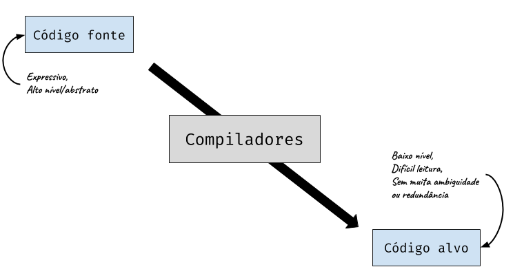
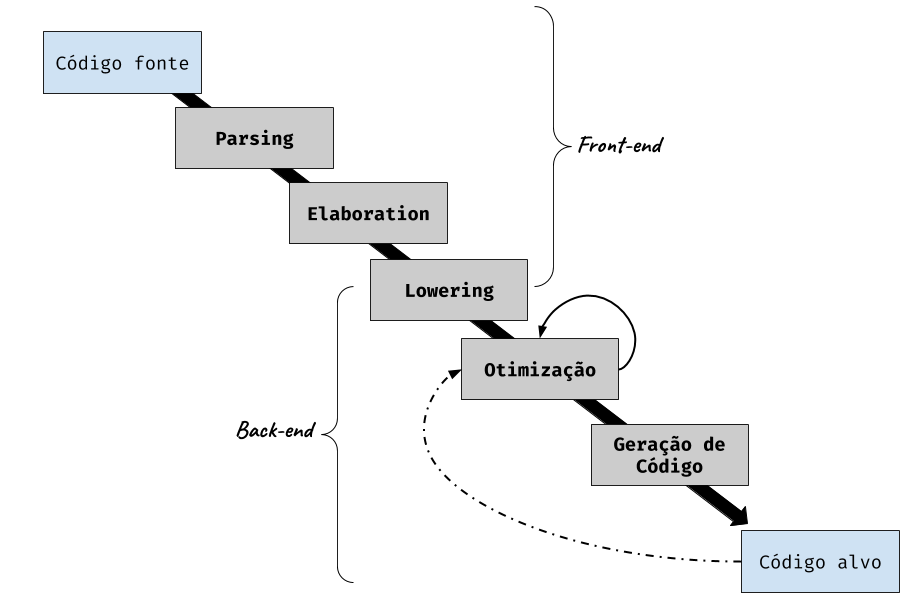
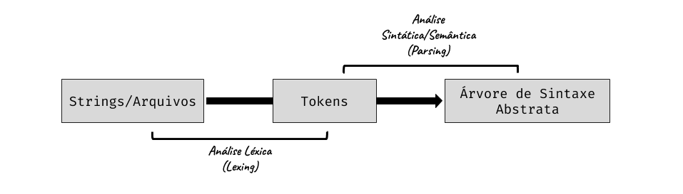
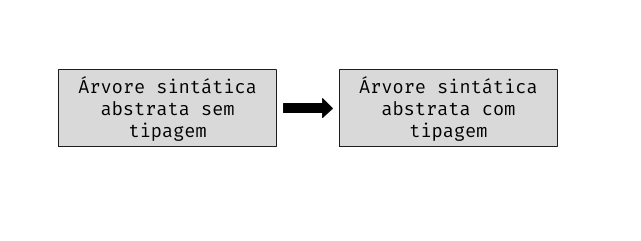
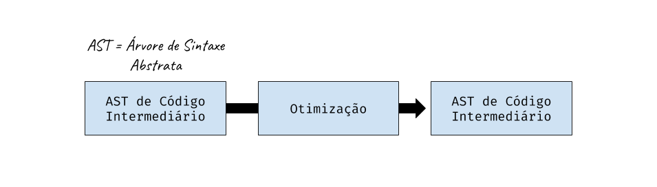

# Semana 01

## Introdução



### Sobre o que é este curso?

- Como os programas escritos em uma linguagem de alto nível (ex.: Java, C++) são transformados em código de máquina?
- Como podemos garantir que um programa tenha um significado (semântica)?
- Como é realizado o gerenciamento de memória do programa?
- Como nós podemos analisar programas para descobrir propriedades invariantes (constantes) e melhorar o desempenho em tempo de execução?

Ao longo do curso todas essas perguntas ficarão mais claras.

### Nota histórica

- Até a década de 50, computadores eram programados em assembly.
- Em 1951-1952, Grace Hopper desenvolveu o sistema A-0 para o UNIVAC I.
  - Posteriormente ela contribuiu significativamente para o desenvolvimento da linguagem COBOL.
- Em 1957 o compilador de FORTRAN foi desenvolvido pela IBM.
  - Com uma equipe liderada por John Backus.
- Na decada de 60 ocorreu o desenvolvimento do primeiro compilador de bootstrapping para LISP.
- Na decada de 70 o design de linguagens/compiladores floresceu*.
- Hoje nós temos milhares de linguagens a disposição (muitas delas pouco utilizadas).
  - Algumas com um design melhor que outras.

### Arquitetura básica

  
*Para manter uma fidelidade maior ao material, optamos por manter alguns termos em inglês. Porém suas equivalências serão feitas posteriormente.

#### Front-end

- Realiza a análise léxica, sintática e semântica (Lexing e Parsing);
  - Faz a conversão de cadeias de caracteres (código fonte) em estruturas de dados internas do compilador.
  - Ocorre usualmente em duas fases:



#### Ferramentas de *Parsing*

- A etapa de *parsing* ocorre basicamente em todas as aplicações.
  - Ex.: Barra de pesquisa do Google, calendários, etc.
  - É o primeiro passo para transformar dados brutos em informação.
- Um pouco de teoria da computação pode te ajudar a entender esses passos (aqui vai um [link](https://cs121.boazbarak.org))
  - Expressões regulares
  - Gramáticas livre de contexto (automato de pilha)
  - Essas abstrações aparecem também na etapa de otimização!
- Existem também muitas ferramentas para te ajudar nessa etapa:
  - Ex.: Yacc e Lex, Menhir, Antlr, *Parsing Combinators*, etc.

#### Análise Semântica (Elaboration)

- É aqui onde ocorre as checagens de tipos.
  - Resolver variáveis, módulos, etc.
  - Checagem das operações sobre os tipos (se a operação é válida sobre aquele tipo de variável).
  - Infere tipos para sub-expressões.
  - Checa outros problemas.



#### Geração de Código Intermediário (Lowering)

- Traduz recursos de alto nível em um pequeno número de instruções.
  - Ex.: `while`, `for`, `do-while` são traduzidos basicamente em instruções utilizando `goto`.
  - Ex.: Objetos, closures e funções de ponteiros.
  - Ex.: Realiza testes de tipagem, verificações de tamanho de arrays, etc. (Explicitamente).

#### Otimização de Código

- Reescreve sequências instruções custosas em sequências menos custosas.
  - Ex.: operações com constantes: `3 + 4` → `7`
  - Ex.: Retira uma instrução invariável de um loop
  - Ex.: Paraleliza um loop



#### Geração de Código

- Traduz o código intermediário em código de máquina (ou algum código alvo).
  - Registra atribuições
  - Instruções de seleção
  - Instruções de scheduling
  - Otimização específica para a arquitetura de cada máquina

### Quem deve fazer o CS153?

- Pessoas facinadas por linguagens de programação e compiladores
  - "Por que esta linguagem não inclue essa feature?"
  - Programadores de sistemas
- Conheça a ferramenta que você usa todos os dias
  - "O que o compilador não pode fazer tão bem?"
- Designers de Arquiteturas
  - Interdependência entre compiladores e arquiteturas
  - Veja as falhas do Intel iAPX 432 e Intel Itanium em relação a compiladores
  - Atualmente, o pessoal da arquitetura usa compiladores também!
- Desenvolvedores de APIs
  - Uma linguagem é uma API
  - Ex.: A linguagem Hack do Facebook.

### Conhecimentos adquiridos

- Você vai aprender sobre:
  - Aplicações práticas da teoria
  - Análise léxica, sintática e interpretadores
  - Como linguagens de alto nível são implementadas em código de máquina
  - (Um subconjunto) da arquitetura Intel x86
  - Mais sobre ferramentas de compiladores como GCC e LLVM
  - Um entendimento maior sobre códigos
  - Um pouco sobre semântica das linguagens de programação, análises de programas e tipos
  - Como manipulas estruturas de dados complexas
  - Como ser um melhor programador

### Pré-requisitos sugeridos

- É interessante saber sobre teoria da computação, estruturas de dados e arquitetura de computadores
- A linguagem utilizada nos materiais é OCaml, porém optamos por adaptar ao [ReasonML](https://reasonml.github.io)

### Administrivia

- [Website do curso](https://www.seas.harvard.edu/courses/cs153)

### Textbook (Leituras sugeridas)

- [Modern Compiler Implementation in ML](https://www.cs.princeton.edu/~appel/modern/ml/) by Andrew W. Appel
  - Recomendado porém não obrigatório
- Na maioria dos casos os matériais disponibilizados serão suficientes

### Ambiente de desenvolvimento

- OCaml
  - Ideal para desenvolver compiladores
    - Desenvolvida para permitir uma fácil manipulação de árvores de sintaxe abstrata (AST)
    - Linguagem funcional com suporte para tipos de dados algébricos polimórficos (genéricos), suporte para módulos e estado mutável.

### Projetos

- 6 projetos serão desenvolvidos, em sua maioria implementando partes de um compilador
- Em sua maioria tomam 2-3 semanas
- Implementados em OCaml (materiais originais) e ReasonML (materiais extras criados por mim)

- 1. HelloOCaml
  - Refrescar um pouco da codificação em OCaml
  - Implementar um interpretador
- 2. x86Lite
  - x86 Assembler e Simulator
  - Entender o código de máquina que buscamos gerar
- 3. Compilação LLVMlite
  - Compilar um subconjunto simples de LLVM para x86Lite
- 4. OAT v1
  - Parsing e Lexing (Análise Léxica e Sintática)
  - Um front-end simples de um compilador
- 5. OAT v2
  - Structs, function pointers (ponteiros de funções)
  - Uma geração de código (intermediário e alvo) simples
- 6. Análise do fluxo de dados e otimização

- **Qualquer dúvida utilizem as [Issues](https://github.com/jose-gilberto/harvard-cs153/issues) do Github como fórum, a comunidade e eu podemos ajudar a resolver. Toda dúvida é válida e deve ser sanada, conhecimento é um bem para todos e todos os níveis dele são válidos :)**

### "História do ML"

- Em 1971, Robin Milner iniciou o projeto LCF em Stanford
  - "Lógica de funções computáveis"
- Em 1973, em Edimburgo, Milner implementou seu provador de teoremas e o apelidou de "Meta Language" - ML para os intimos.
- Em 1984, o ML escapou para o mundo selvagem e se tornou "Standard ML"
  - SML'97 é a versão mais nova do Standard
  - Há uma grande família de compiladores SML:
    - SML/NJ: desenvolvido na AT&T Bell Labs
    - Poly/ML
    - Moscow ML
    - ML Kit Compiler
    - MLj: Compilador SML para Java bytecode
    - MLton: compilador de otimização de programa inteiro
    - CakeML: dialeto para ser fácil de programar e raciocinar sobre
- ML2000: falha na padronização revisada
- sML: sucessor do ML (discutido de forma intermitente)
- Veja um pouco mais [aqui](http://sml-family.org/)

### História do OCaml

- Em 1987, Guy Cousineau reimplementou uma variação do ML
  - A implementação foi nomeada como "Categorical Abstract Machine" (CAM)
  - Rapidamente, "CAM-ML" se tornou "CAML"
- Em 1991, Xavier Leroy e Damien Doligez escreveram Caml-light
  - Compilando CAML para uma máquina virtual com um bytecode simples (bem mais rápido)
- Em 1996, Xavier Leroy, Jérôme Vouillon e Didier Rémy:
  - Adicionaram um sistema de objetos para criar o **OCaml**
  - Adicionaram também uma compilação de código nativo
- Muitas atualizações, extensões foram feitas desde então
- A linguagem F# da Microsoft é descendente do OCaml
- Um pouco mais você pode encontrar [aqui](https://ocaml.org/)

### Ferramentas do OCaml

- ocaml
- ocamlc: compilador de bytecode
- ocamlopt: compilador de código nativo
- ocamldep: analisador de dependências
- ocamldoc: gerador de documentação
- ocamllex: o gerador de analisadores léxicos (lexer)
- ocamlyacc: gerador de analisadores sintáticos (parser)
- menhir: um gerador de analisadores sintáticos (parser) mais moderno
- ocamlbuild: um gerenciador de compilação
- utop
- opam: gerenciador de pacotes

### Uma linguagem simples

- Considerando uma linguagem simples com expressões e comandos
- Exemplo de programa para computar fatoriais:
```
X = 6;
ANS = 1;
whileNZ (X) {
    ANS = ANS * X;
    X = X + -1;
}
```
- Para descrever essa linguagem nós precisamos de:
  - Sintaxe: que sequência de caracteres formam comandos válidos/programa válido?
  - Semântica: o que um programa significa?

```
<exp> ::=
      | <X>
      | <exp> + <exp>
      | <exp> * <exp>
      | <exp> < <exp>
      | <integer constant>
      | (<exp>)
```

```
<cmd> ::=
      | skip
      | <X> = <exp>
      | ifNZ <exp> { <cmd> } else { <cmd> }
      | whileNZ <exp> { <cmd> }
      | <cmd>; <cmd>
```

- **Sintaxe Concreta** (gramática) para uma linguagem imperativa simples
  - Escrita na forma de Backus-Naur (*Backus-Naur form*)
  - `<exp>` e `<cmd>` são símbolos não terminais
  - `::=`, `|` e `<...>` são partes da metalinguagem
  - Palavras chave, como `skip` e `ifNZ`, e símbolos como `{` e `+` fazem parte da linguagem objeto
- Precisa representar a sintaxe abstrata (ou seja, ocultar partes irrelevantes da sintaxe concreta)
- Implementar a semântica operacional (ou seja, define o comportamento/ignificado do programa)
- Veja a seguir:

```ocaml
(* Implementação de uma simples linguagem orientada a comandos. *)


(* gramática ------------------------------------------------------------------ *)
(*
 gramática BNF para essa simples linguagem:
  <exp> ::= 
         |  <X>
         |  <exp> + <exp>
         |  <exp> * <exp>
         |  <exp> < <exp>
         |  <integer constant>
         |  (<exp>)

  <cmd> ::= 
         |  skip
         |  <X> = <exp>
         |  ifNZ <exp> { <cmd> } else { <cmd> }
         |  whileNZ <exp> { <cmd> }
         |  <cmd>; <cmd>
*)

(* Sintáxe Abstrata (AST) ---------------------------------------------------- *)

type var = string

type exp =
  | Var of var
  | Add of (exp * exp)
  | Mul of (exp * exp)
  | Lt  of (exp * exp)
  | Lit of int

type cmd =
  | Skip
  | Assn    of var * exp
  | IfNZ    of exp * cmd * cmd
  | WhileNZ of exp * cmd
  | Seq     of cmd * cmd


(* AST para o exemplo Fatorial ------------------------------------------------ *)
(*
        X = 6;
	ANS = 1;
	whileNZ (x) {
  		ANS = ANS * X;
  		X = X + -1;
	} 
 *)

let factorial : cmd =
  let x = "X" in
  let ans = "ANS" in
  Seq (Assn (x, Lit 6),
       Seq (Assn (ans, Lit 1),
            WhileNZ(Var x,
                    Seq (Assn(ans, Mul(Var ans, Var x)),
                         Assn(x, Add(Var x, Lit (-1)))))))

(* Interpretador -------------------------------------------------------------- *)

type state = var -> int

let rec interpret_exp (s:state) (e:exp) : int =
  match e with
  | Var x -> s x
  | Add (e1, e2) -> (interpret_exp s e1) + (interpret_exp s e2)
  | Mul (e1, e2) -> (interpret_exp s e1) * (interpret_exp s e2)
  | Lt  (e1, e2) -> if (interpret_exp s e1) < (interpret_exp s e2) then 1 else 0
  | Lit n -> n

let update s x v =
  fun y -> if x = y then v else s y

let rec interpret_cmd (s:state) (c:cmd) : state =
  match c with
  | Skip -> s
  | Assn (x, e1) ->
    let v = interpret_exp s e1 in
    update s x v
  | IfNZ (e1, c1, c2) ->
    if (interpret_exp s e1) = 0 then interpret_cmd s c2 else interpret_cmd s c1
  | WhileNZ (e, c) ->
    if (interpret_exp s e) = 0 then s else interpret_cmd s (Seq(c, WhileNZ (e, c)))
  | Seq (c1, c2) ->
    let s1 = interpret_cmd s c1 in
    interpret_cmd s1 c2
  
let init_state : state = fun _ -> 0
```